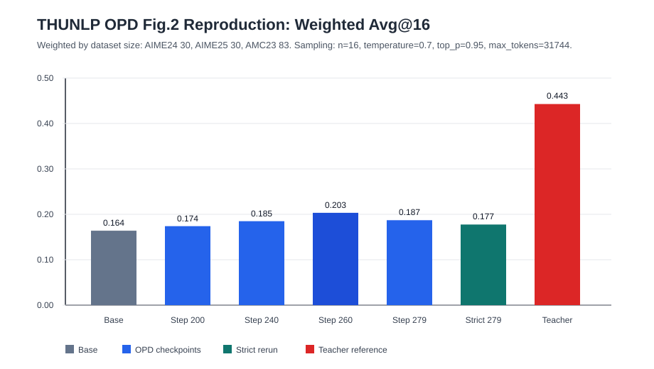

# THUNLP OPD Reproduction Record

This document is the lightweight record kept after cleaning the large remote intermediate outputs.

## Experiment Target

Paper: **Rethinking On-Policy Distillation of Large Language Models: Phenomenology, Mechanism, and Recipe**.

Main official code path:

```text
verl/verl/trainer/main_ppo.py
verl/verl/trainer/ppo/ray_trainer.py
verl/verl/workers/actor/dp_actor.py
```

The reproduced training is the Fig.2-style setting:

```text
student: Qwen3-1.7B-Base
teacher: Qwen3-4B-Base-GRPO
data: DAPO-Math-17K
evaluation: AIME24, AIME25, AMC23
```

## Evaluation Protocol

The main retained evaluation uses:

```text
n = 16
temperature = 0.7
top_p = 0.95
top_k = -1
max_tokens = 31744
max_model_len = 32768
prompt = Qwen3 chat template with enable_thinking=True
```

The weighted score below is weighted by dataset size:

```text
AIME24: 30
AIME25: 30
AMC23: 83
```

## Main Results



| model | weighted Avg@16 | AIME24 | AIME25 | AMC23 |
|---|---:|---:|---:|---:|
| Qwen3-1.7B-Base | 0.1639 | 0.0333 | 0.0333 | 0.2583 |
| OPD step 200 | 0.1740 | 0.0375 | 0.0063 | 0.2839 |
| OPD step 240 | 0.1849 | 0.0646 | 0.0500 | 0.2771 |
| OPD step 260 | 0.2032 | 0.0958 | 0.0438 | 0.2997 |
| OPD step 279 | 0.1871 | 0.0875 | 0.0208 | 0.2831 |
| Strict rerun step 279 | 0.1774 | 0.0417 | 0.0354 | 0.2779 |
| Qwen3-4B-GRPO teacher | 0.4427 | 0.2667 | 0.2333 | 0.5821 |

Raw retained CSV files:

```text
docs/reproduction/thunlp_opd_fig2_repro_results.csv
docs/reproduction/thunlp_opd_weighted_summary.csv
```

## Interpretation

The corrected Fig.2-style run shows a modest OPD improvement over the Qwen3-1.7B-Base baseline, with the best retained point at step 260:

```text
0.2032 - 0.1639 = +0.0393 weighted Avg@16
```

This is far below the teacher reference:

```text
teacher weighted Avg@16 = 0.4427
```

The result should be treated as a partial reproduction, not a clean reproduction of the paper's headline gains. The main failure modes found during reproduction were:

- prompt/thinking mismatch can collapse evaluation;
- using the wrong student family, such as SFT instead of Base, changes the experiment;
- intermediate validation with long responses is very expensive;
- keeping every FSDP checkpoint quickly creates terabytes of output.

## Remote Paths Before Cleanup

The large remote output tree was:

```text
/data/zhu.ximo/opd_repro/outputs/thunlp_opd
```

The largest subdirectory was:

```text
/data/zhu.ximo/opd_repro/outputs/thunlp_opd/checkpoints
```

It was about 1.9T and mostly consisted of FSDP training checkpoints.

The persistent backup kept before cleanup is:

```text
/data/zhu.ximo/opd_repro/backups/thunlp_opd/20260521_env
```

That backup contains the runtime environment and logs, but not a duplicate copy of the 1.9T checkpoint tree.

## Continue From Here

If this project is resumed, start from:

```text
CODE_READING_GUIDE.md
REPRO_BACKUP.md
docs/reproduction/thunlp_opd_reproduction_record.md
```

For new runs, keep only:

- the launch command;
- final `summary.csv`;
- a compact Markdown result record;
- one selected merged checkpoint if it is actually needed for future evaluation.

Do not keep every FSDP checkpoint by default.
